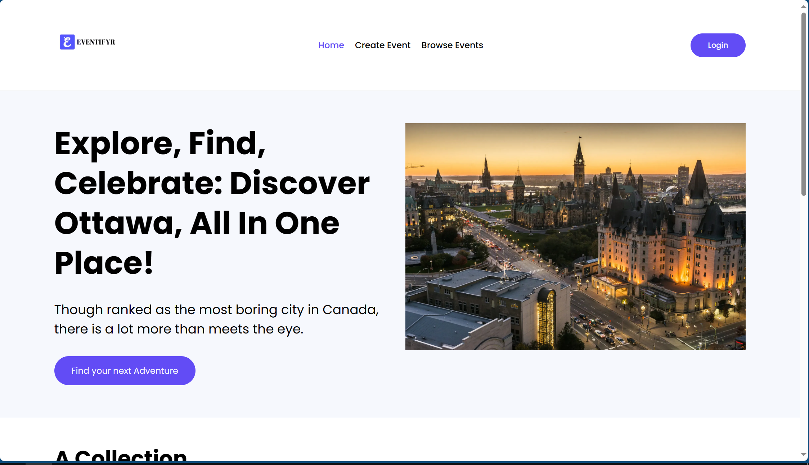
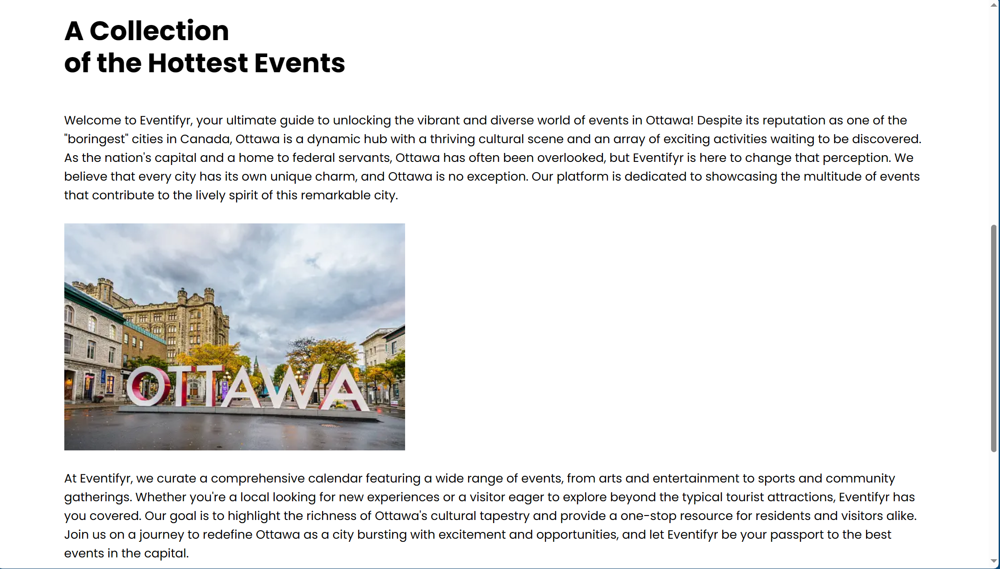
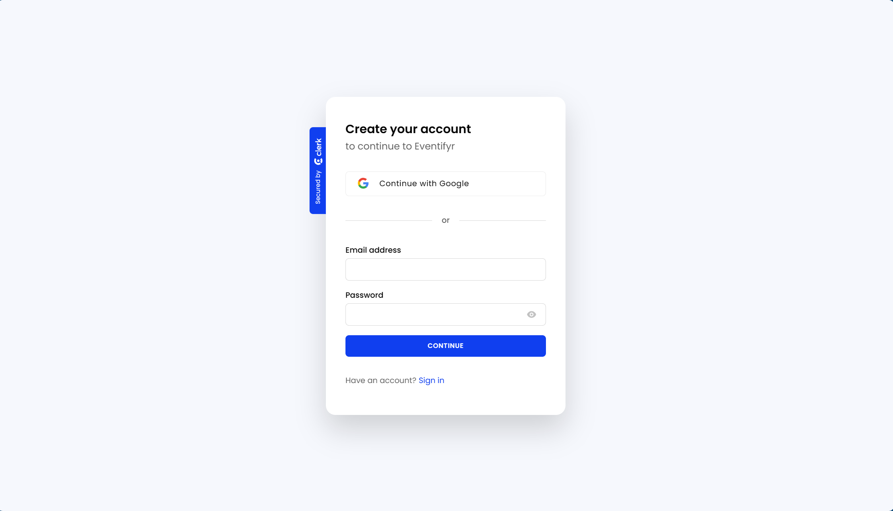
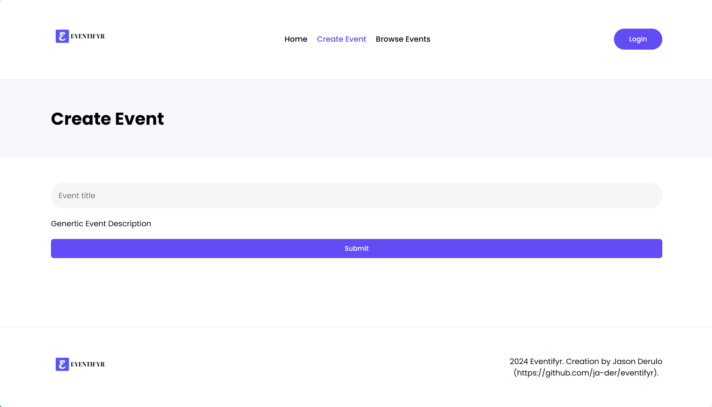
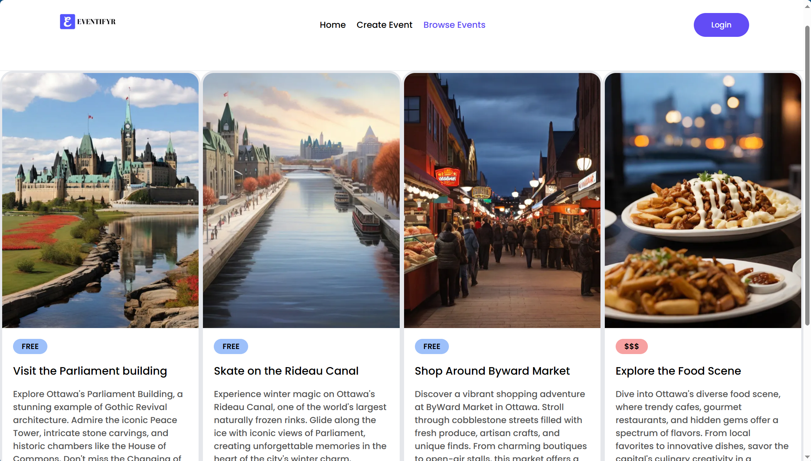

# Eventifyr - Find your next Event

https://eventifyr.vercel.app/

Welcome to Eventifyr, your go-to platform for discovering and tracking events in Ottawa! Whether you're a local resident or a visitor, Eventifyr is designed to make sure you never miss out on the vibrant and diverse events happening in the city.

## Preview

### HomePage

 

### Account Sign-In/ Authentication

### Event Creation

### Event Browser

## Features

- **Event Discovery:** Explore a wide range of events happening in Ottawa, from concerts and festivals to art exhibitions and community gatherings.

- **Personalized Tracking:** Create an account to customize your event preferences and receive personalized event recommendations.

- **Event Details:** Get comprehensive information about each event, including title, price, venue, and a brief description.

## Getting Started

To get started with Eventifyr, follow these simple steps:

1. **Visit the Website:** Go to [https://eventifyr.vercel.app/](https://eventifyr.vercel.app/) to access the Eventifyr platform.

2. **Create an Account:** Sign up for an account to unlock personalized event recommendations and tracking features.

3. **Explore Events:** Browse through the wide array of events listed on the platform to find something that interests you.
